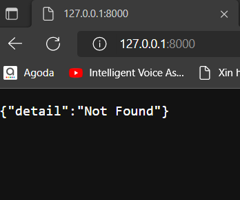
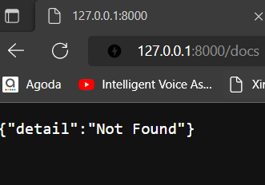
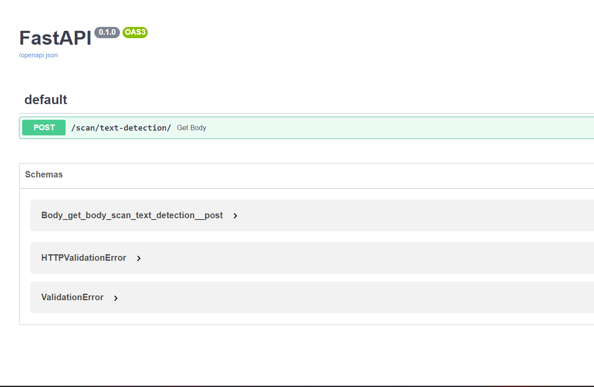
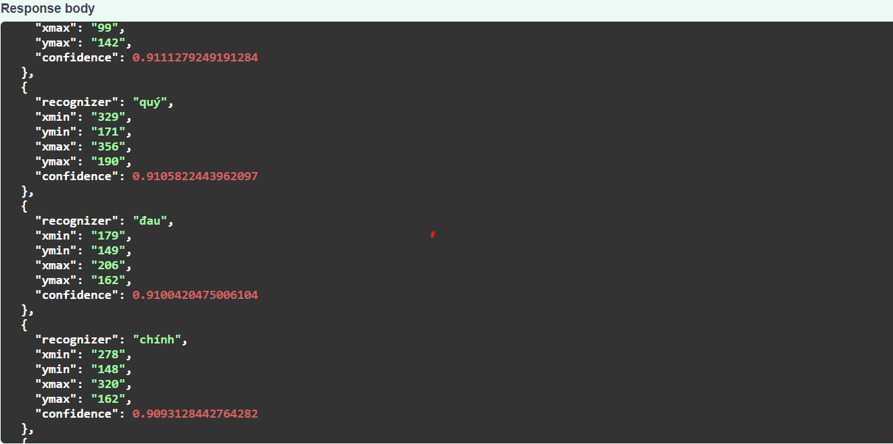

# Vietnamese and English Text Recognition API

    This project is running on python version 3.8.10 and pip lastest version

    So follow task below for installing and running this project

                                    Thank you !!!

#   1 -> Install python libraries: 

    pip install -r requirements.txt

#   2 -> Run this code, please using command line: 

    uvicorn api:main --host 'your_local_host' --port 8000

#   3 -> If you access to your local host, please config your link from: 

    http://127.0.0.1:8000/ to http://127.0.0.1:8000/docs

# changing 

# To access the Swagger API

#   If no issue was occurred, the result will be like this:

#   4 -> Get your result by uploading image from your local, the result will be in Json format.
    
    The result will be showed like this:

